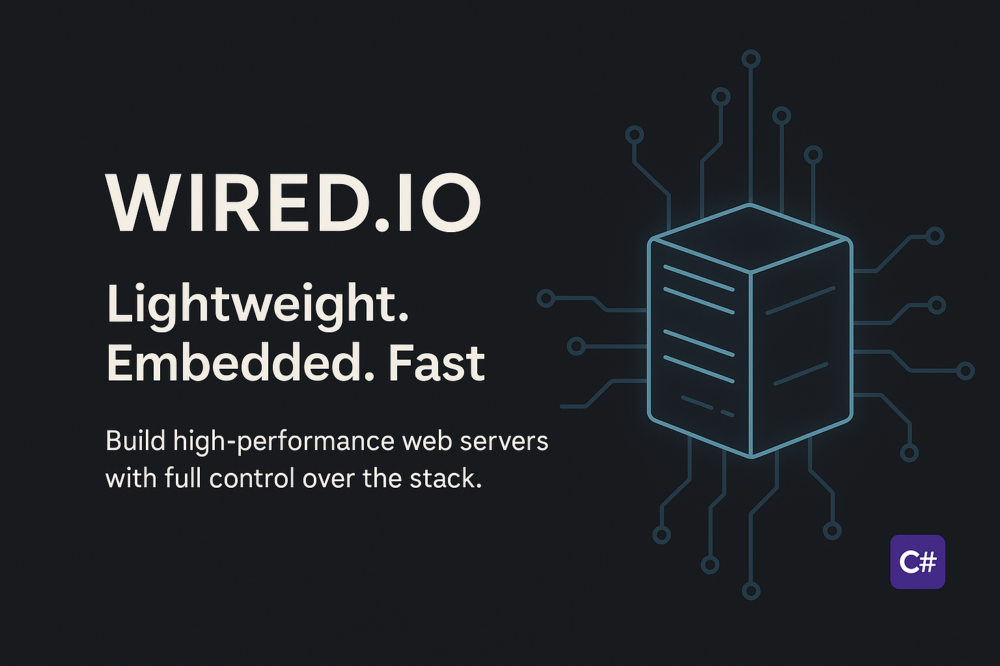

 

## Get Started


  
  


**Wired.IO** is a lightweight, embeddable HTTP server for .NET — built as a minimal alternative to Kestrel. It runs on .NET 8+ and is ideal for low-overhead applications where performance, control, and customizability matter.

Unlike traditional servers, Wired.IO is designed to be fully integrated into your application — no external processes, no hidden abstraction layers. It plugs directly into the .NET hosting model by implementing IHost, so you can run it alongside background services, workers, and other infrastructure using the standard dependency injection and lifecycle system.

With Wired.IO, you can choose to use the built-in HTTP/1.1 server — or go deeper and define your own HTTP handler to support custom protocols, message parsing, or entirely different transport behavior. This flexibility makes it a perfect fit for both conventional APIs and deeply specialized applications.

⚡ Whether you're building a high-throughput microservice, a device control interface, or integrating HTTP into a non-web app — Wired.IO gives you precise control with near-zero overhead.

### When to choose Wired.IO

- When embedding your webserver in existing app such as .NET WPF, MAUI, Winforms, AvaloniaUI etc.
- When you need lower level HTTP protocol control.
- Great for small footprint background services.
- Also ideal for low to medium sized backlog servers.