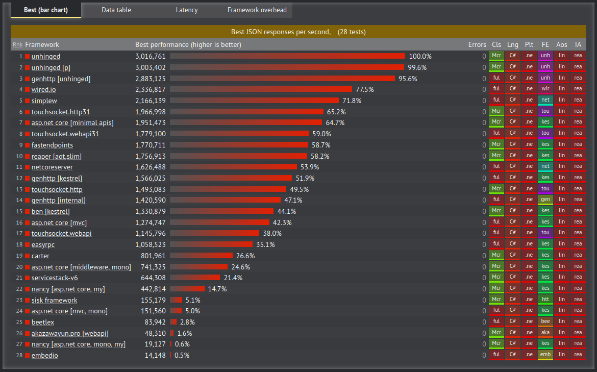
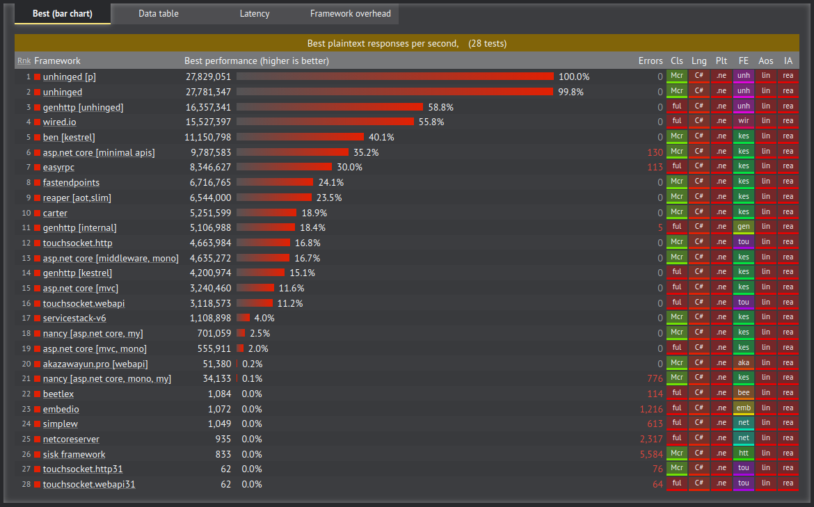

 

According to most recent TechEmpower benchmark results (December, 20, 2025)

Wired.IO ranks amongs the highest performing C# frameworks, ranking only behind the still early development ultra high performing Unhinged engine. Worth to note that Wired.IO is the fastest among the competitors that use C# Socket class which provides cross platform support and great robustness and reliability.

Platform level entries were filtered out.

### Json Serialization Test

Json Serialization test was chosen as it represents the framework true performance, database access frameworks depend on the ORM logic and database usage. 

### Plaintext Test

This text benchmarks the frameworks request handling and parsing capabilities as it uses a 16 depth pipelining.

